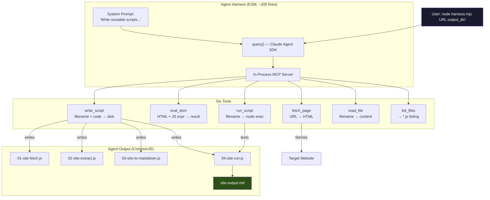

# Claude Agent SDK: Teaching an AI to Write Web Scrapers

What if instead of writing web scrapers yourself, you could give Claude a URL and have it write the scraper for you — then test it, fix any bugs, and hand you back a set of clean, reusable Node.js scripts?

That's what I built over a weekend using the Claude Agent SDK. The result is a ~200-line harness that gives Claude six tools (fetch a page, evaluate DOM expressions, write files, run scripts, read files, list files) and a system prompt that teaches it the exploration-then-generation workflow. You point it at a URL, and it produces a working extraction pipeline.

This post walks through the entire process: the problem I was solving, the architecture of the harness, the five experiments that led to the working design, and the surprising quality of the code Claude produces when you give it the right tools and constraints.

> [!summary]
> This project is:
> 1. a practical demonstration of the Claude Agent SDK's in-process MCP tool system
> 2. a study in prompt engineering for code generation — how the system prompt shapes what the agent builds
> 3. a tool that actually works: tested on lobste.rs and slashdot.org, producing clean extraction scripts in under 3 minutes each

## The problem: web scraping is tedious but formulaic

I'd been building web-to-markdown extraction scripts by hand for four different sites — Hacker News, NYTimes, WonderOS, and GitHub. Each site required the same workflow:

1. Fetch the HTML
2. Open a REPL or write exploration scripts to understand the DOM structure
3. Find the repeating content pattern (what CSS selector grabs each story?)
4. Write the extraction logic (which child elements hold the title, URL, score, etc.)
5. Format the extracted data as markdown
6. Test, debug, fix edge cases

The output was always the same four-file pipeline:

```
XX-site-fetch.js       →  HTTP fetch + jsdom → document
XX-site-extract.js     →  querySelectorAll → data objects
XX-site-to-markdown.js →  data → markdown string
XX-site-run.js         →  orchestrator → .md file
```

After doing this four times, the pattern was clear. The exploration phase is where all the thinking happens — which selectors to use, how the data is nested, what edge cases exist. The code generation is mechanical. That makes it a perfect candidate for automation: the "thinking" part is what LLMs are good at (understanding structure, making decisions), and the "coding" part is what they're also good at (generating syntactically correct, idiomatic JavaScript).

## The Claude Agent SDK in 60 seconds

The Agent SDK is Anthropic's TypeScript library for building AI agents. Its core abstraction is `query()` — you give it a prompt and a set of tools, and Claude works autonomously until it's done.

The key feature for this project is **in-process MCP tools**. MCP (Model Context Protocol) is the standard for connecting AI models to external capabilities. The Agent SDK lets you define tools right in your JavaScript code using `tool()` and `createSdkMcpServer()`:

```javascript
import { query, tool, createSdkMcpServer } from "@anthropic-ai/claude-agent-sdk";
import { z } from "zod";

const myTool = tool(
  "tool_name",                        // name Claude sees
  "Description of what this does",     // Claude reads this to decide when to use it
  { input: z.string() },              // Zod schema → auto-converted to JSON Schema
  async (args) => {                    // handler function
    return { content: [{ type: "text", text: "result" }] };
  }
);

const server = createSdkMcpServer({ name: "my-server", tools: [myTool] });

for await (const message of query({
  prompt: "Do something useful",
  options: {
    mcpServers: { "my-server": server },
    permissionMode: "bypassPermissions",
    allowDangerouslySkipPermissions: true,
    maxTurns: 30,
  },
})) {
  if ("result" in message) console.log(message.result);
}
```

That's the entire API surface. Define tools with Zod schemas, bundle them into an MCP server, pass the server to `query()`. Claude sees the tool descriptions and decides when to call them.

## Five experiments to a working design

I didn't arrive at the final harness in one step. Here's the progression, including the failures.

### Experiment 1: Can we even import the SDK?

```javascript
// scripts/01-agent-sdk-hello.mjs
import { query } from "@anthropic-ai/claude-agent-sdk";

for await (const message of query({
  prompt: "Say hello in one sentence.",
  options: { allowedTools: [], maxTurns: 1 },
})) {
  if ("result" in message) console.log("Result:", message.result);
}
```

**Result:** "Hello!" — confirmed the SDK works. The `query()` async iterable yields system messages, assistant messages, and finally a result.

### Experiment 2: Custom tools — blocked by permissions

Added `fetch_page` and `eval_dom` tools. Claude tried to call them but got blocked:

> "I'm unable to proceed because the `mcp__dom-scraper__fetch_page` tool requires permission approval."

The Agent SDK has a permission system that prompts the user before running MCP tools. In a headless/automated context, there's no one to approve. This was the first lesson: you need `permissionMode: "bypassPermissions"` plus `allowDangerouslySkipPermissions: true` for automated harnesses.

### Experiment 3: Working tools

With permissions bypassed, Claude successfully fetched Hacker News and counted stories:

```
[fetch_page] Fetching https://news.ycombinator.com/...
[fetch_page] Got 34774 chars
[eval_dom] Evaluating: document.querySelectorAll('tr.athing').length...
[eval_dom] Result (2 chars): 30

=== Result ===
The Hacker News front page contains 30 stories.
```

Two tool calls, correct answer. The `eval_dom` tool parses HTML with jsdom and evaluates arbitrary JS expressions against the `document` object — exactly like typing in a browser console.

### Experiment 4: Wrong design — agent scrapes directly

My first attempt at the full system gave Claude a `save_file` tool and asked it to scrape a page. Claude did it beautifully — 3 tool calls, clean markdown output. But this was the **wrong design**. The agent was doing the scraping itself, producing a one-shot markdown file. If you wanted to re-scrape the same site tomorrow, you'd have to run the agent again.

The goal was for the agent to **write reusable scripts** that anyone can run with `node XX-run.js`.

### Experiment 5: The working harness

The fix was changing the tools and the system prompt. Instead of `save_file`, I gave Claude `write_script` and `run_script`. Instead of "scrape this page", the prompt says "create reusable Node.js scripts that scrape this page." The distinction sounds subtle, but it completely changes the agent's behavior: it shifts from being a scraper to being a scraper-writer.

## The six tools

The harness gives Claude six tools. Each is about 15-25 lines of code.

### `fetch_page` — the agent's eyes

Downloads a URL and returns the HTML. Truncates to 80KB to fit in the context window. Claude uses this to get the raw material it will explore.

```javascript
const fetchPage = tool(
  "fetch_page",
  "Fetch a web page and return its raw HTML.",
  { url: z.string().describe("URL to fetch") },
  async ({ url }) => {
    const res = await fetch(url, {
      headers: { "User-Agent": "Mozilla/5.0 (compatible; dom-scraper/1.0)" }
    });
    const html = await res.text();
    return { content: [{ type: "text", text: html.slice(0, 80000) }] };
  }
);
```

### `eval_dom` — the agent's REPL

This is the most important tool. It parses HTML with jsdom and evaluates a JavaScript expression against the `document` object. Claude uses it like a developer would use a browser console — iteratively probing the DOM to understand the structure.

```javascript
const evalDom = tool(
  "eval_dom",
  `Parse HTML with jsdom and evaluate a JS expression against the document.
'document' is available. Use standard DOM APIs.
Wrap multi-statement code in an IIFE: (() => { ...; return result; })()`,
  {
    html: z.string(),
    expression: z.string(),
  },
  async ({ html, expression }) => {
    const { JSDOM } = await import("jsdom");
    const { document } = new JSDOM(html).window;
    const fn = new Function("document", `"use strict"; return (${expression})`);
    const result = fn(document);
    // ... serialize result, truncate if needed
  }
);
```

The `new Function("document", ...)` pattern creates a sandboxed evaluation context where only `document` is in scope. No `require`, no `process`, no `fs` — just the DOM.

### `write_script` — the agent's output

Writes a JavaScript file to the output directory. This is how the agent produces its deliverable: reusable CommonJS scripts.

### `run_script` — the agent's test runner

Executes a generated script with `node` and returns stdout/stderr. Claude uses this to verify its scripts actually work. If the test fails, it reads the script, diagnoses the error, and writes a fix.

### `read_file` and `list_files` — housekeeping

`read_file` lets Claude review previously written scripts. `list_files` lists existing `.js` files so Claude knows what number prefix to use next.

## The system prompt: where the magic happens

The system prompt is the most critical component. It teaches Claude the workflow:

```text
You are an expert web scraper and JavaScript developer. Your job is to
CREATE REUSABLE NODE.JS SCRIPTS that extract content from web pages
and convert it to Markdown.

## Your workflow:
1. Explore — Use fetch_page + eval_dom to understand the DOM
2. Design — Figure out the extraction strategy
3. Write scripts — fetch, extract, to-markdown, run modules
4. Test — Use run_script to verify
5. Fix — If tests fail, read_file to inspect, then write_script to fix

## Script conventions:
- CommonJS (require/module.exports)
- jsdom is available
- Header comment documenting DOM selectors
- XX- prefix naming
```

Three things make this prompt effective:

1. **"CREATE REUSABLE NODE.JS SCRIPTS"** — not "scrape this page." This is the single most important phrase. Without it, the agent does the scraping itself (Experiment 4).

2. **Explicit workflow ordering** — explore before writing. Without this, the agent sometimes skips exploration and generates generic extraction code that doesn't match the actual DOM.

3. **"Document the DOM selectors"** — this pushes the agent to include header comments listing the CSS selectors it uses, which makes the generated code reviewable.

## Real results: lobste.rs

I ran the harness on lobste.rs and watched the tool calls stream by:

```
[fetch_page] https://lobste.rs/             → 60KB HTML
[eval_dom]   full extraction expression      → 25 stories as JSON
[list_files]                                 → "(no .js files)"
[write_script] 01-lobsters-fetch.js          → 1KB
[write_script] 02-lobsters-extract.js        → 3.8KB
[write_script] 03-lobsters-to-markdown.js    → 2.2KB
[write_script] 04-lobsters-run.js            → 1.4KB
[run_script]   04-lobsters-run.js            → 8.7KB markdown ✓
```

Eight tool calls. About 2 minutes. The agent explored the DOM with a single comprehensive `eval_dom` call, then wrote four scripts and tested them. The test passed on the first try.

Here's a sample of the extraction script it wrote:

```javascript
// DOM selectors used:
//   ol.stories.list > li.story           — each story row
//   li[data-shortid]                     — story short ID
//   .story_liner .voters .upvoter        — vote score (text)
//   .story_liner .details .link a.u-url  — title text + external href
//   .story_liner .details .tags .tag     — tag labels
//   .story_liner .details .domain        — source domain
//   .story_liner .details .byline .u-author — submitter username

function extractStories(document) {
  const items = document.querySelectorAll('ol.stories.list > li.story');
  const stories = [];

  for (const li of items) {
    const shortId = li.getAttribute('data-shortid');
    if (!shortId) continue;  // skip spacer/ad rows

    const score = parseInt(
      li.querySelector('.voters .upvoter')?.textContent.trim(), 10
    ) || 0;
    // ... 15 more field extractions
  }
  return stories;
}
```

This is good code. It has JSDoc type definitions, header comments documenting every selector, edge case handling for non-story rows, and `new URL()` for resolving relative comment links. It's the kind of code I'd write by hand — except I didn't.

## Real results: slashdot.org

Slashdot has a completely different DOM structure: `article[data-fhtype="story"]` containers with nested `span.story-title`, `span.story-byline`, `span.dept-text`, and `div[id^="text-"]` for the full story body. The agent figured all of this out:

```
[fetch_page] https://slashdot.org/          → 145KB HTML
[eval_dom]   DOM structure analysis           → title, selectors
[write_script] 01-slashdot-fetch.js          → 1.5KB
[write_script] 02-slashdot-extract.js        → 4.7KB
[write_script] 03-slashdot-to-markdown.js    → 3.0KB
[write_script] 04-slashdot-run.js            → 1.6KB
[run_script]   04-slashdot-run.js            → 15 stories ✓
```

The Slashdot extractor pulled out fields I might not have thought to grab: the "dept" tagline ("from the through-the-backdoor dept."), the topic/category from image alt text, and the full story body as both HTML and plaintext. It handled protocol-relative URLs (`//it.slashdot.org/...` → `https://it.slashdot.org/...`) correctly.

## What the agent gets right

After examining both generated codebases, here's what stands out:

**Selector documentation.** Every extraction script has a header block listing the exact CSS selectors used. This is invaluable for maintenance — when the site's DOM changes, you know exactly which selectors to update.

**Type definitions.** The lobste.rs script includes a full `@typedef` JSDoc block describing the `Story` shape. The Slashdot script documents it as a comment block. Both make the data model explicit.

**Edge case handling.** Both scripts skip non-content rows: lobste.rs skips elements without `data-shortid`, Slashdot filters with `.filter(s => s.title)`. These aren't naive "grab everything" scripts.

**Idiomatic JavaScript.** Proper use of optional chaining (`?.`), nullish coalescing, `Array.from()` for NodeLists, `parseInt` with radix argument. The code reads like it was written by someone who knows JavaScript.

## What the agent misses

**No exploration trail.** When I scrape manually, I produce 4-8 numbered exploration scripts that document my discovery process. The agent does its exploration via `eval_dom` calls that aren't saved. If the site changes, there's no record of why specific selectors were chosen.

**Single-pass exploration.** A human would probe the DOM incrementally — first count elements, then examine containers, then trace parent chains. The agent tends to do one big `eval_dom` that combines multiple queries. This works but produces less insight into the DOM structure.

**No dedup logic.** For NYTimes, I had to add explicit deduplication because the page renders story-wrappers twice (desktop and mobile layouts). The agent wouldn't know to do this unless the site happened to produce duplicate entries.

## The architecture as a diagram



## Running it yourself

```bash
# Install dependencies
npm install jsdom @anthropic-ai/claude-agent-sdk zod

# Set your API key
export ANTHROPIC_API_KEY=sk-ant-...

# Run on any URL
node scripts/05-agent-sdk-script-writer.mjs "https://lobste.rs/" ./generated/
node scripts/05-agent-sdk-script-writer.mjs "https://slashdot.org/" ./generated-slashdot/

# Then run the generated pipeline independently
cd generated && node 04-lobsters-run.js
```

The harness uses Sonnet 4.6 by default (~$0.10-0.30 per run). For complex sites, switch to Opus 4.6 for deeper reasoning.

## Key takeaways

**The system prompt is the product.** The six tools are straightforward JavaScript. The system prompt is what makes the agent explore before generating, follow naming conventions, document selectors, and test its output. Change the prompt, change the behavior.

**In-process MCP tools are powerful and simple.** No subprocess, no IPC, no protocol plumbing. Define a function with a Zod schema, pass it to `createSdkMcpServer()`, and Claude can call it. The Agent SDK handles serialization, the agentic loop, and error propagation.

**The agent's exploration is efficient but opaque.** A human produces 4-8 exploration scripts documenting the DOM investigation. The agent does it in 1-2 `eval_dom` calls. The result is faster but less auditable. For production use, you'd want to log the eval_dom expressions and results as an exploration trail.

**Permission bypass is essential for automation.** The Agent SDK defaults to prompting for tool approval — appropriate for interactive use, but a blocker for headless harnesses. The `bypassPermissions` + `allowDangerouslySkipPermissions` pattern is the escape hatch, and the double opt-in makes the security tradeoff explicit.

**Claude writes better scrapers than I expected.** JSDoc types, selector documentation, edge case handling, idiomatic JavaScript. The quality is high enough that I'd merge these scripts with minor review. The main gap is the exploration trail — the scripts work, but the reasoning behind the selector choices isn't captured.

## Source code

All code is in the project repository at `/home/manuel/code/wesen/2026-03-21--experiment-dom/`:

| File | Description |
|---|---|
| `scripts/01-agent-sdk-hello.mjs` | Experiment 1: basic SDK import test |
| `scripts/02-agent-sdk-custom-tool.mjs` | Experiment 2: custom tools (permissions blocked) |
| `scripts/03-agent-sdk-bypass-perms.mjs` | Experiment 3: working tools with bypass |
| `scripts/04-agent-sdk-full-scrape.mjs` | Experiment 4: wrong design (agent scrapes directly) |
| `scripts/05-agent-sdk-script-writer.mjs` | Experiment 5: **the working harness** |
| `generated/01-04-lobsters-*.js` | Agent-generated lobste.rs pipeline |
| `generated-slashdot/01-04-slashdot-*.js` | Agent-generated slashdot.org pipeline |

The detailed design document is at `ttmp/.../AGENT-SCRAPE/.../design-doc/01-agent-scraper-design-and-implementation-guide.md` and covers tool implementations, security considerations, and the agent's behavioral patterns in depth.
