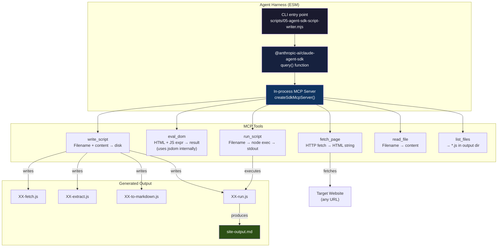
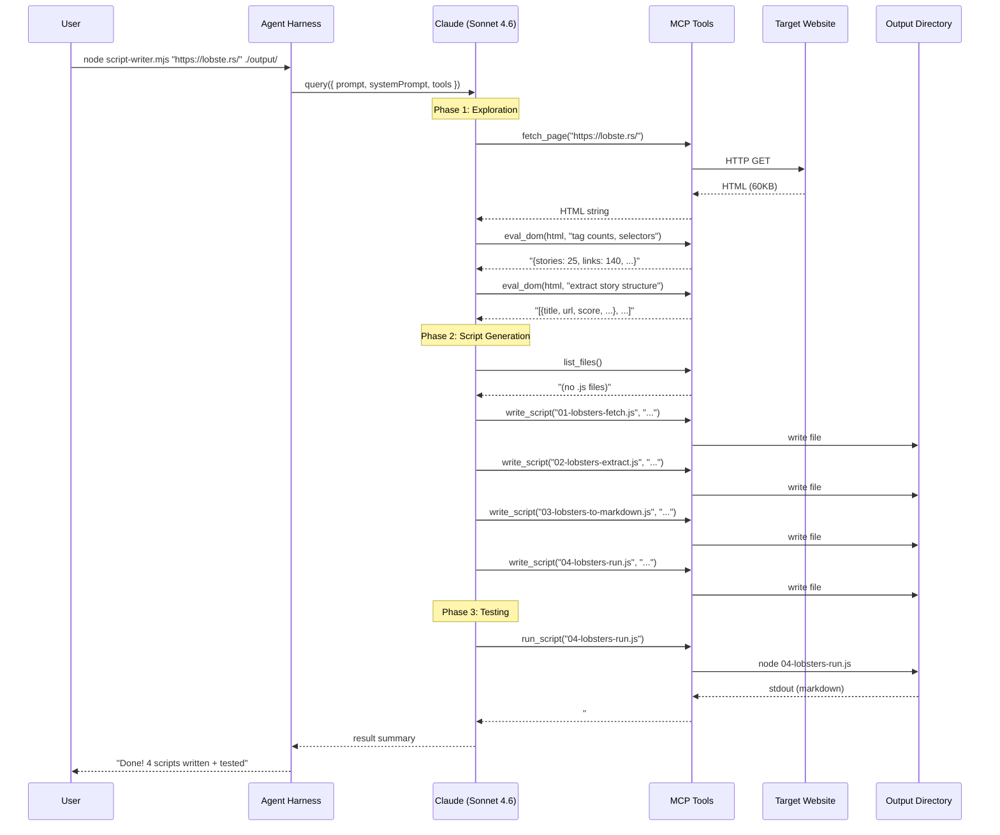

# Agent Scraper: Design and Implementation Guide

## For New Team Members

This document explains how to build a system where a Claude AI agent autonomously creates JavaScript scripts that extract structured content from websites and convert it to Markdown. The agent doesn't do the scraping itself — it **writes the scripts** that humans (or CI) then run independently. Think of it as an AI that writes web scrapers for you.

If you're new to this codebase, start by reading the "Background" section to understand the manual process the agent automates, then "System Architecture" for the big picture, and "Implementation Details" for the code.

---

## Executive Summary

We have a proven manual workflow for turning web pages into Markdown: fetch HTML with Node.js, parse it with `jsdom`, explore the DOM structure with iterative `querySelectorAll` queries, then write modular extraction scripts. This design document describes how to automate that workflow using the **Claude Agent SDK** — a TypeScript library that lets you give Claude tools and have it work autonomously.

The key insight from our prototype: Claude, when given a `fetch_page` tool, an `eval_dom` tool, and a `write_script` tool, can successfully explore an unfamiliar website's DOM, figure out the CSS selectors and data model, and generate working Node.js extraction scripts — including testing them. We proved this on lobste.rs: the agent produced 4 clean, documented scripts in a single run, with correct JSDoc types and DOM selector documentation.

> **Core idea:** Instead of a human writing `05-nyt-explore-structure.js` → `06-nyt-explore-stories.js` → ... → `12-nyt-run.js`, the agent does the exploration and code generation in one pass.

---

## Background: The Manual Process Being Automated

Before understanding the agent, you need to understand what it automates. This section describes the manual workflow we've been using across four sites (Hacker News, NYTimes, WonderOS, GitHub).

### The four-file pipeline pattern

Every site follows the same modular architecture:

```
XX-<site>-fetch.js       →  HTTP fetch + jsdom parse → returns document
XX-<site>-extract.js     →  DOM queries → structured data objects
XX-<site>-to-markdown.js →  data objects → formatted markdown string
XX-<site>-run.js         →  orchestrator: fetch → extract → markdown → write .md file
```

For example, the Hacker News pipeline:
- `01-fetch-hn.js` — fetches `https://news.ycombinator.com/`, returns jsdom `document`
- `02-extract-stories.js` — `document.querySelectorAll('tr.athing')` → array of story objects
- `03-to-markdown.js` — story objects → formatted markdown with headings, links, metadata
- `04-run.js` — orchestrates the three modules, writes `hn-frontpage.md`

### The exploration process

Before writing extraction scripts, a human explores the DOM iteratively:

1. **Tag inventory** — count elements, list `data-*` attributes, dump headings. "What's in this HTML?"
2. **Zoom in** — find the repeating container pattern (e.g., `div.story-wrapper` for NYT)
3. **Deep dive** — extract all fields from each container. "Can I reliably get headline, summary, metadata?"
4. **Section mapping** — understand which containers are content vs. duplicates
5. **Write scripts** — implement the pipeline based on findings
6. **Debug** — verify completeness, fix edge cases

This process takes 4-8 exploration scripts per site. The agent does steps 1-6 in one run.

### Key technical concepts

**jsdom** is a Node.js library that parses HTML strings into a standard DOM that supports the same `querySelector`/`querySelectorAll`/`textContent`/`getAttribute` API as a browser. No browser process needed.

```javascript
const { JSDOM } = require('jsdom');
const { document } = new JSDOM('<html>...</html>').window;
document.querySelectorAll('tr.athing').length; // works exactly like a browser
```

**CommonJS modules** (`require`/`module.exports`) are used for the generated scripts so they can `require()` each other. The agent harness itself uses ESM (`import`/`export`) since the Agent SDK requires it.

---

## System Architecture

### High-level overview

```
┌─────────────────────────────────────────────────┐
│                 Agent Harness                     │
│         (scripts/05-agent-sdk-script-writer.mjs)  │
│                                                   │
│  ┌───────────────┐  ┌────────────────────────┐   │
│  │ Claude Agent   │  │ Custom MCP Tools       │   │
│  │ (Sonnet 4.6)  │◄─┤                        │   │
│  │               │  │ • fetch_page            │   │
│  │  System prompt│  │ • eval_dom              │   │
│  │  guides the   │  │ • write_script          │   │
│  │  exploration  │  │ • run_script            │   │
│  │  + generation │  │ • read_file             │   │
│  │  workflow     │  │ • list_files            │   │
│  └───────────────┘  └────────────────────────┘   │
│                                                   │
│  Input: URL + output directory                    │
│  Output: numbered .js files + .md result          │
└─────────────────────────────────────────────────┘

     ▼ generates ▼

┌─────────────────────────────────────┐
│  Generated Pipeline (CommonJS)       │
│                                      │
│  XX-site-fetch.js                    │
│  XX-site-extract.js                  │
│  XX-site-to-markdown.js              │
│  XX-site-run.js                      │
│                                      │
│  Run: node XX-site-run.js            │
│  Output: site-output.md              │
└─────────────────────────────────────┘
```

### Component diagram



### Data flow for a single run



---

## The Six MCP Tools

The agent interacts with the outside world through six custom tools, defined as in-process MCP tools using the Agent SDK's `tool()` helper and `createSdkMcpServer()`. This section documents each tool in detail.

### Tool 1: `fetch_page`

**Purpose:** Download a web page's HTML so the agent can explore its DOM structure.

**Input schema:**
```typescript
{ url: z.string().describe("The URL to fetch") }
```

**What it does:**
1. Calls Node's built-in `fetch()` with a browser-like User-Agent header
2. Reads the response body as text
3. Truncates to 80KB (to fit within context window limits)
4. Returns the HTML string

**Why 80KB?** Claude's context window is 200K tokens. 80KB of HTML is roughly 20-30K tokens, leaving room for the system prompt, conversation history, and tool results. Most sites' server-rendered HTML fits well within this limit (HN is 35KB, NYT is 1.3MB but the first 80KB contains all the story structure).

**Implementation:**
```javascript
const fetchPage = tool(
  "fetch_page",
  "Fetch a web page and return its raw HTML.",
  { url: z.string().describe("URL to fetch") },
  async ({ url }) => {
    const res = await fetch(url, {
      headers: { "User-Agent": "Mozilla/5.0 (compatible; dom-scraper/1.0)" }
    });
    const html = await res.text();
    return { content: [{ type: "text", text: html.slice(0, 80000) }] };
  }
);
```

**Edge cases:**
- Sites that require JavaScript rendering (SPAs) won't work — the HTML will be an empty shell. For these, you'd need to add Playwright as a tool.
- Some sites block non-browser User-Agents. The `Mozilla/5.0` prefix handles most cases.
- Redirects are followed automatically by `fetch()`.

### Tool 2: `eval_dom`

**Purpose:** Parse HTML with jsdom and evaluate a JavaScript expression against the `document` object. This is the agent's "eyes" into the DOM — it uses this to explore structure, count elements, trace parent chains, and prototype extraction queries.

**Input schema:**
```typescript
{
  html: z.string().describe("HTML string to parse with jsdom"),
  expression: z.string().describe("JS expression to evaluate. 'document' is in scope."),
}
```

**What it does:**
1. Parses the HTML string with `new JSDOM(html)`
2. Creates a `Function` with `document` in scope
3. Evaluates the expression and serializes the result
4. Truncates output to 30KB

**Why a Function constructor?** The agent needs to run arbitrary DOM queries. `new Function("document", "return (" + expression + ")")` creates a sandboxed function with only `document` in scope. This is intentionally limited — the function can't access `require`, `process`, `fs`, or other Node.js APIs.

**Implementation:**
```javascript
const evalDom = tool(
  "eval_dom",
  "Parse HTML with jsdom and evaluate a JS expression against the document.",
  {
    html: z.string(),
    expression: z.string(),
  },
  async ({ html, expression }) => {
    const { JSDOM } = await import("jsdom");
    const { document } = new JSDOM(html).window;
    try {
      const fn = new Function("document", `"use strict"; return (${expression})`);
      const result = fn(document);
      let output = typeof result === "object"
        ? JSON.stringify(result, null, 2)
        : String(result);
      if (output.length > 30000) output = output.slice(0, 30000) + "\n...(truncated)";
      return { content: [{ type: "text", text: output }] };
    } catch (err) {
      return { content: [{ type: "text", text: `Error: ${err.message}` }] };
    }
  }
);
```

**How the agent uses this tool:**

The agent typically calls `eval_dom` 2-5 times per site, with progressively more specific expressions:

1. **Inventory:** `(() => { return { articles: document.querySelectorAll('article').length, h2s: document.querySelectorAll('h2').length, ... } })()`
2. **Container discovery:** `[...document.querySelectorAll('.story-wrapper')].slice(0, 3).map(w => w.outerHTML.slice(0, 500))`
3. **Full extraction:** `[...document.querySelectorAll('li.story')].map(li => ({ title: li.querySelector('.link a')?.textContent, ... }))`

**Security note:** The expression runs in a `new Function` with only `document` in scope. It cannot access the file system, network, or Node.js APIs. However, the HTML being parsed could contain malicious content — `jsdom` doesn't execute `<script>` tags by default, which is the right behavior.

### Tool 3: `write_script`

**Purpose:** Write a JavaScript file to the output directory. This is the agent's primary output — it uses this to create the reusable extraction pipeline scripts.

**Input schema:**
```typescript
{
  filename: z.string().describe("Filename like '01-hn-fetch.js'"),
  content: z.string().describe("Full JS file content (CommonJS)"),
}
```

**Implementation:**
```javascript
const writeScript = tool(
  "write_script",
  "Write a JavaScript file to the output directory.",
  { filename: z.string(), content: z.string() },
  async ({ filename, content }) => {
    const safeName = path.basename(filename); // prevent path traversal
    const fullPath = path.join(OUTPUT_DIR, safeName);
    writeFileSync(fullPath, content);
    return { content: [{ type: "text", text: `Written: ${fullPath}` }] };
  }
);
```

**Security:** `path.basename()` strips directory components, preventing path traversal attacks (e.g., `../../etc/passwd`).

### Tool 4: `run_script`

**Purpose:** Execute a generated JS file with Node.js and return its stdout/stderr. The agent uses this to test its generated scripts.

**Input schema:**
```typescript
{ filename: z.string().describe("Filename to run") }
```

**What it does:**
1. Verifies the file exists
2. Runs it with `execSync("node <file>")` with a 30-second timeout
3. Returns stdout (truncated to 20KB) or stderr on failure

**Why `execSync`?** The generated scripts are CommonJS modules that run as standalone processes. `execSync` is the simplest way to run them and capture output. The 30-second timeout prevents runaway processes.

**Security:** The script runs with the same privileges as the harness process. Only files in the output directory can be executed (enforced by `path.basename()`).

### Tool 5: `read_file`

**Purpose:** Read a file the agent previously wrote. Used when the agent needs to review or fix a script.

### Tool 6: `list_files`

**Purpose:** List all `.js` files in the output directory. The agent uses this to determine the next number prefix for new scripts and to verify what it's already created.

---

## The System Prompt

The system prompt is the most critical piece of the harness. It teaches Claude how to use the tools to follow the exploration → generation → testing workflow. Here is the full prompt with annotations:

```text
You are an expert web scraper and JavaScript developer. Your job is to CREATE
REUSABLE NODE.JS SCRIPTS that extract content from web pages and convert it to
Markdown.

## Your workflow:

1. **Explore** — Use fetch_page + eval_dom to understand the site's DOM structure
2. **Design** — Figure out the extraction strategy (which selectors, what data model)
3. **Write scripts** — Use write_script to create a set of modular JS files:
   - A fetch module (fetches HTML, parses with jsdom, returns document)
   - An extract module (runs DOM queries, returns structured data objects)
   - A markdown module (transforms data into formatted markdown)
   - A run script (orchestrates the pipeline, writes output file)
4. **Test** — Use run_script to execute your scripts and verify they work
5. **Fix** — If tests fail, read_file to inspect, then write_script to fix

## Script conventions:
- Use CommonJS (require/module.exports)
- jsdom is already installed (require('jsdom'))
- Each script should have a header comment explaining what it does
- Extract scripts should document the DOM selectors used
- Name files with XX- prefix (use list_files to find the next number)
- The run script should write a .md file AND print to stdout

## Quality standards:
- Scripts must actually run and produce correct output
- Handle edge cases (missing elements, empty text)
- Dedup where needed
- The markdown output should be clean and readable
```

**Why this prompt structure works:**

1. **Role framing** ("expert web scraper and JavaScript developer") — sets the skill level and domain
2. **Explicit workflow** (numbered steps) — prevents the agent from jumping to code generation before exploring
3. **Script conventions** — ensures generated code matches the project's existing style
4. **Quality standards** — pushes the agent to test and handle edge cases

---

## Implementation Details

### Setting up the project

**Prerequisites:**
- Node.js 18+ (for built-in `fetch()`)
- npm packages: `jsdom`, `@anthropic-ai/claude-agent-sdk`, `zod`
- Environment variable: `ANTHROPIC_API_KEY`

**Installation:**
```bash
npm install jsdom @anthropic-ai/claude-agent-sdk @anthropic-ai/sdk zod
```

**File structure:**
```
project/
├── scripts/
│   └── 05-agent-sdk-script-writer.mjs    ← the harness
├── generated/                             ← output directory for agent-written scripts
├── package.json
└── node_modules/
    ├── jsdom/
    ├── @anthropic-ai/claude-agent-sdk/
    ├── @anthropic-ai/sdk/
    └── zod/
```

### The Agent SDK `query()` function

The Agent SDK's `query()` function is the main entry point. It returns an async iterable of messages. Here's how we call it:

```javascript
import { query, tool, createSdkMcpServer } from "@anthropic-ai/claude-agent-sdk";

// Define tools (see above)
const server = createSdkMcpServer({
  name: "script-writer",
  tools: [fetchPage, evalDom, writeScript, runScript, readFile, listFiles],
});

for await (const message of query({
  prompt: "Create a reusable pipeline for: https://example.com/",
  options: {
    mcpServers: { "script-writer": server },  // register the MCP server
    permissionMode: "bypassPermissions",       // auto-approve all tool calls
    allowDangerouslySkipPermissions: true,     // required for bypassPermissions
    maxTurns: 30,                              // prevent infinite loops
    systemPrompt: SYSTEM_PROMPT,               // the prompt above
    model: "claude-sonnet-4-6",                // fast + capable
  },
})) {
  if ("result" in message) {
    console.log(message.result);  // final agent output
  }
}
```

**Key options explained:**

| Option | Value | Why |
|---|---|---|
| `mcpServers` | `{ "script-writer": server }` | Registers our in-process MCP server with 6 tools |
| `permissionMode` | `"bypassPermissions"` | The harness runs unattended; we trust our own tools |
| `allowDangerouslySkipPermissions` | `true` | Required safety acknowledgment for bypass mode |
| `maxTurns` | `30` | Exploration + 4 writes + test + possible fixes. 30 is generous. |
| `model` | `"claude-sonnet-4-6"` | Sonnet 4.6 is fast and capable for code generation. Opus 4.6 for harder sites. |

### In-process MCP tools vs. external MCP servers

The Agent SDK supports two ways to provide tools:

1. **External MCP server** — a separate process (e.g., `npx @playwright/mcp@latest`). The SDK launches it as a subprocess and communicates via stdio.
2. **In-process MCP server** — tools defined in the same process using `tool()` + `createSdkMcpServer()`. No subprocess, no IPC overhead.

We use in-process tools because:
- Our tools are simple (fetch, eval, file I/O) — no need for a separate process
- In-process tools have zero latency for tool calls
- We can use closures (e.g., `OUTPUT_DIR` is captured from the parent scope)

**How `tool()` works:**

```javascript
import { tool } from "@anthropic-ai/claude-agent-sdk";
import { z } from "zod";

const myTool = tool(
  "tool_name",           // name (Claude sees this)
  "Description text",     // description (Claude reads this to decide when to use the tool)
  { input: z.string() }, // input schema as a Zod object (auto-converted to JSON Schema)
  async (args) => {       // handler function
    // args is typed based on the Zod schema
    return {
      content: [{ type: "text", text: "result" }]  // MCP response format
    };
  }
);
```

The `tool()` function creates an MCP tool definition. The Zod schema is automatically converted to JSON Schema for the tool definition, and used for runtime validation of inputs.

**How `createSdkMcpServer()` works:**

```javascript
import { createSdkMcpServer } from "@anthropic-ai/claude-agent-sdk";

const server = createSdkMcpServer({
  name: "my-server",     // server name (for logging/debugging)
  tools: [tool1, tool2], // array of tools created with tool()
});
```

This creates an in-process MCP server that the Agent SDK can connect to. Pass it in the `mcpServers` option of `query()`.

### Message types from `query()`

The `query()` async iterable yields several message types:

```javascript
for await (const message of query({ ... })) {
  if ("result" in message) {
    // Final result — agent is done
    console.log(message.result);
    console.log(message.stop_reason); // "end_turn", "max_tokens", etc.
  } else if (message.type === "system" && message.subtype === "init") {
    // Session started — capture session_id for resumption
    const sessionId = message.session_id;
  } else if (message.type === "assistant") {
    // Intermediate assistant message (text or tool calls)
  }
}
```

For our harness, we only care about the `result` message — it contains the agent's final summary of what it did.

---

## How the Agent Explores a Website

Based on our experiments, here is the typical agent behavior when given a new URL:

### Step 1: Fetch and inventory

The agent calls `fetch_page` to get the HTML, then calls `eval_dom` with a broad inventory expression:

```javascript
// Agent's typical first eval_dom call
(() => {
  return {
    articles: document.querySelectorAll('article').length,
    sections: document.querySelectorAll('section').length,
    h1s: [...document.querySelectorAll('h1')].map(h => h.textContent.trim()),
    h2s: [...document.querySelectorAll('h2')].map(h => h.textContent.trim()),
    links: document.querySelectorAll('a').length,
    // ... more counts
  };
})()
```

### Step 2: Identify the repeating content pattern

Based on the inventory, the agent identifies candidate container elements and examines them:

```javascript
// Agent examines the first few instances of the main content pattern
[...document.querySelectorAll('li.story')].slice(0, 3).map(li => ({
  classes: li.className,
  childTags: [...li.children].map(c => c.tagName),
  text: li.textContent.trim().slice(0, 200),
}))
```

### Step 3: Prototype the full extraction

Once the pattern is clear, the agent writes a complete extraction expression:

```javascript
// Full extraction — this becomes the basis for the extract.js script
[...document.querySelectorAll('li.story')].map(li => ({
  title: li.querySelector('.link a')?.textContent.trim(),
  url: li.querySelector('.link a')?.getAttribute('href'),
  score: parseInt(li.querySelector('.upvoter')?.textContent) || 0,
  // ... all fields
}))
```

### Step 4: Generate scripts

The agent translates its eval_dom exploration into modular CommonJS scripts, adding proper error handling, JSDoc types, and documentation of the DOM selectors used.

### Step 5: Test and fix

The agent runs the generated scripts with `run_script` and examines the output. If something fails, it uses `read_file` to inspect the script, identifies the bug, and uses `write_script` to fix it.

---

## Quality of Agent-Generated Scripts

From our lobste.rs experiment, the agent-generated extraction script (`02-lobsters-extract.js`) had these quality characteristics:

**Good:**
- Proper JSDoc type definitions (`@typedef`)
- Header comments documenting every DOM selector used
- Edge case handling (`if (!shortId) continue` to skip non-story rows)
- Clean data model with all relevant fields
- `new URL()` for resolving relative URLs

**Areas for improvement (future work):**
- No exploration trail — the intermediate exploration queries are lost (only the final scripts are saved)
- No deduplication logic (not needed for lobste.rs, but would be for NYT)
- Error handling in fetch could be more robust (no retry, no timeout)

---

## Configuration and Extensibility

### Running the harness

```bash
# Basic usage
node scripts/05-agent-sdk-script-writer.mjs <URL> <output-dir>

# Examples
node scripts/05-agent-sdk-script-writer.mjs "https://lobste.rs/" ./generated/
node scripts/05-agent-sdk-script-writer.mjs "https://news.ycombinator.com/" ./hn-scripts/
node scripts/05-agent-sdk-script-writer.mjs "https://www.nytimes.com/" ./nyt-scripts/
```

### Choosing a model

The harness uses `claude-sonnet-4-6` by default. This is fast and good for most sites. For complex sites (NYT with dual layouts, GitHub with JSON data islands), switch to `claude-opus-4-6` for deeper reasoning:

```javascript
model: "claude-opus-4-6",  // for complex sites
model: "claude-sonnet-4-6", // for simple sites (default)
```

### Adding new tools

To extend the harness, add new tools to the MCP server:

```javascript
const myNewTool = tool(
  "tool_name",
  "Description",
  { /* Zod schema */ },
  async (args) => { /* implementation */ }
);

const server = createSdkMcpServer({
  name: "script-writer",
  tools: [fetchPage, evalDom, writeScript, runScript, readFile, listFiles, myNewTool],
});
```

**Potential new tools:**
- `run_playwright` — for sites that require JavaScript rendering
- `save_exploration` — save intermediate exploration results as numbered scripts
- `read_existing_pipeline` — read scripts from a reference site to learn the pattern

### Adjusting the system prompt

The system prompt controls the agent's behavior. Key areas to tune:

- **Script conventions** — change to ESM, add TypeScript, etc.
- **Markdown format** — specify the desired output style
- **Exploration depth** — add "always check for duplicate containers" for NYT-style sites
- **Domain-specific hints** — "for GitHub, check for JSON data in script tags"

---

## Comparison: Manual vs. Agent

| Aspect | Manual (human) | Agent harness |
|---|---|---|
| Exploration scripts | 4-8 numbered .js files | 2-5 eval_dom calls (not saved) |
| Time to working pipeline | 30-60 minutes | 2-5 minutes |
| Script quality | Excellent (human review) | Good (needs review for edge cases) |
| Edge case handling | Thorough (debug scripts) | Basic (covers common cases) |
| Documentation | Detailed diary | Header comments + JSDoc |
| Reproducibility | Every exploration step saved | Only final scripts saved |
| Novel DOM patterns | Human intuition spots anomalies | May miss unusual patterns |
| Cost | Developer time | ~$0.10-0.50 per run (Sonnet) |

### When to use which

- **Use the agent** for: quick prototyping, well-structured sites, one-off extractions, sites similar to ones you've already done
- **Use manual exploration** for: complex sites with unusual DOM patterns, sites where correctness is critical, when you need the exploration trail as documentation

---

## Open Questions and Future Directions

1. **Should the agent save exploration scripts too?** Currently only the final pipeline scripts are saved. Adding an `exploration_log` would make the agent's process reproducible.

2. **Multi-page support:** The current harness handles single pages. For multi-page sites (like WonderOS with `/`, `/hello/`, `/poster/`), the agent would need to discover and process all pages.

3. **Incremental refinement:** Can the agent read existing scripts and improve them? This would support a workflow where you run the agent, review the output, and ask it to fix specific issues.

4. **Template library:** Could we teach the agent common patterns (news feed, blog, product page, GitHub repo) so it starts with better assumptions?

5. **Integration with the diary system:** The agent could write diary entries describing its exploration and design decisions, matching the docmgr format.

---

## API Reference Summary

### Claude Agent SDK (TypeScript)

```typescript
import { query, tool, createSdkMcpServer } from "@anthropic-ai/claude-agent-sdk";
import { z } from "zod";

// Define a tool
const myTool = tool(name, description, zodSchema, handlerFn);

// Create MCP server
const server = createSdkMcpServer({ name: "...", tools: [...] });

// Run the agent
for await (const msg of query({
  prompt: "...",
  options: {
    mcpServers: { name: server },
    permissionMode: "bypassPermissions",
    allowDangerouslySkipPermissions: true,
    maxTurns: 30,
    systemPrompt: "...",
    model: "claude-sonnet-4-6",
  },
})) {
  if ("result" in msg) console.log(msg.result);
}
```

### Key npm packages

| Package | Version | Purpose |
|---|---|---|
| `@anthropic-ai/claude-agent-sdk` | latest | Agent SDK — `query()`, `tool()`, `createSdkMcpServer()` |
| `@anthropic-ai/sdk` | latest | Low-level Claude API (dependency of Agent SDK) |
| `jsdom` | latest | HTML → DOM parsing |
| `zod` | latest | Schema validation for tool inputs |

### File reference

| File | Purpose |
|---|---|
| `scripts/01-agent-sdk-hello.mjs` | Minimal Agent SDK test — verifies import and basic query |
| `scripts/02-agent-sdk-custom-tool.mjs` | Tests in-process MCP tools (fetch_page + eval_dom) |
| `scripts/03-agent-sdk-bypass-perms.mjs` | Tests permission bypass mode |
| `scripts/04-agent-sdk-full-scrape.mjs` | Agent that scrapes directly (not the target design) |
| `scripts/05-agent-sdk-script-writer.mjs` | **The harness** — agent that writes reusable scripts |
| `generated/01-lobsters-fetch.js` | Agent-generated: fetch module for lobste.rs |
| `generated/02-lobsters-extract.js` | Agent-generated: extraction with DOM selectors |
| `generated/03-lobsters-to-markdown.js` | Agent-generated: markdown formatter |
| `generated/04-lobsters-run.js` | Agent-generated: orchestrator |
